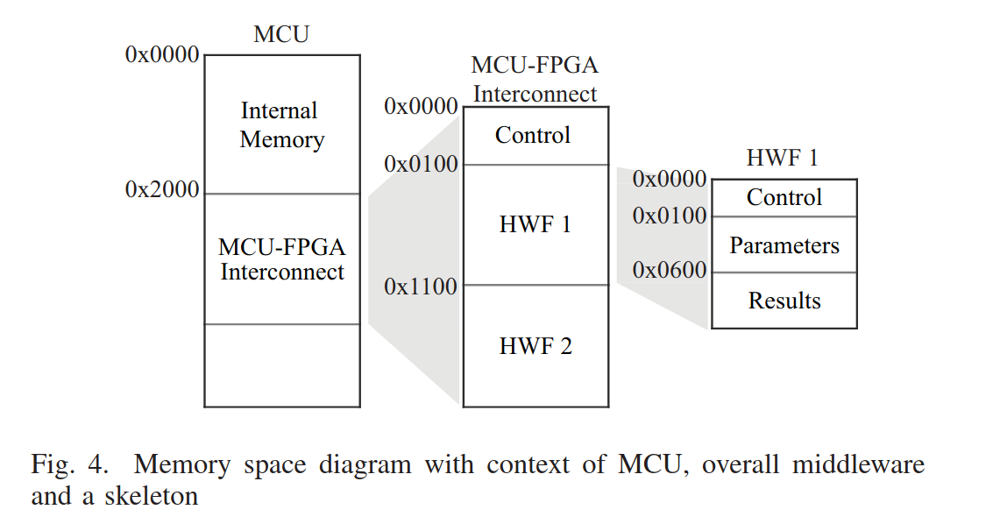

# Elastic Node Middleware

## Getting Started

The [docs](docs) folder contains a [getting started guide](docs/ElasticNodeGettingStartedGuide.md) with a minimal working example.

## Hardware

The used hardware is listed in the [Elastic Node Hardware repository](https://github.com/es-ude/ElasticNodeHardware) on github.
-----> v4 gibt es da nicht?! Error!

## Libraries

The elastic node middleware code includes several libraries:
- elastic node middleware
- reconfigure multiboot avr
- xmem
- pin definition
- interrupt Manager
- uart

In the files "graph_elasticNodeMiddlewareLib.png" and "graph_elasticNodeMiddleware_ConfigureFPGALib.png" you can see the dependencies between these libraries.
They are described in the following.

### Elastic Node Middleware Lib

The elastic node middleware lib consists of the elastic node middleware interface as well as the elastic node middleware configure FPGA interface and the internal interface.
The outsourcing in internal interfaces are only for testing purposes.
An application user has not use the internal interface and should only use the public functions in the elasticNodeMiddleware and elasticNodeMiddleware_configureFPGA interface. 
The elastic node middleware lib contains the following functions:

- for initialising the elastic node middleware:\
→ elasticnode_initialise
- for turning the FPGA on:\
→ elasticnode_fpgaPowerOn
- for turning the FPGA off:\
→ elasticnode_fpgaPowerOff
- to read and write one Byte or a data stream from the FPGA:\
→ elasticnode_writeOneByteBlockingFromFpga\
→ elasticnode_writeDataBlockingFromFpga\
→ elasticnode_readOneByteBlockingFromFpga\
→ elasticnode_readDataBlockingFromFpga
- to reset the FPGA:\
→ elasticnode_fpgaSoftReset\
→ elasticnode_fpgaHardReset

(difference soft and hard reset -> explain)

The elastic node middleware configure FPGA lib contains the following functions:

- reconfigure FPGA to specific state:\
→ elasticnode_configureFPGA_configureFrom
- get current loaded configuration:\
→ elasticnode_configureFPGA_getLoadedConfiguration

We split these application functions into two interfaces.
Unfortunately, this is necessary to avoid cycle dependencies between the elasticnode middleware lib and the reconfiguration lib.

### Reconfigure Multiboot Avr

The reconfigure multiboot avr lib handles the reconfiguration for the FPGA.
The library is specialised for avr, because we use an avr-microcontroller in the elastic node.
Multiboot is here the type of reconfiguration.
Using multi-boot means that we select one configuration and provide the address of the next configuration to the internal configuration access port (ICAP) interface of the FPGA.

The reconfigure multiboot avr again contains an reconfigure_multiboot_avr interface and for this an internal interface. 
An application user again should only use the public functions in the "normal" interface.
The functions are:

- for initialising the reconfiguration:\
→ reconfigure_initMultiboot
- for reconfigure the FPGA with multiboot technique:\
→ reconfigure_fpgaMultiboot
- for the interrupt service routine, which checks for reconfiguration:\
→ reconfigure_interruptSR
- for returning the current offset from the address in the memory:\
→ reconfigure_getMultibootAddress
- for returning if the reconfiguration is complete:\
→ reconfigure_fpgaMultibootComplete

### Xmem

The xmem library initializes, enables and disables the external memory interface. 
The external memory is used to interconnect between the MCU and the FPGA.
The functions of the xmem library are:

- for initialising the external memory:\
→ xmem_initXmem
- for enabling the external memory:\
→ xmem_enableXmem
- for disabling the external memory:\
→ xmem_disableXmem

In the header file of the xmem library we define the offset of the external memory.
By using the elastic node, the offset is 0x2000, as seen in the image below. 

### Pin Definition

The pin definition library defines all pin and register definitions.
Therefore, all pin and register definitions are at one point in the code. 

### Interrupt Manager

The interrupt manager library clears and set interrupts. 
Our interrupts are again implemented for avr. 

### Uart

The uart library is used for communication with the MCU. 
It is only used for testing purposes. 

## Elastic Node Platform

The required hardware from the elastic node, which is used in our code, is the MCU and the FPGA.
For interconnection of the MCU and the FPGA we use the MCU's external memory interface (XMEM).

### Memory-mapped Interface (XMEM)

The XMEM interface is an addressable data interface.
For using it, you define a variable at a specific memory location and write the data value into it.
The FPGA detects this and reacts accordingly.
The following photo is from the above mentioned paper. 

The interconnection between MCU and FPGA starts in this case at the internal memory address 0x2000 from the MCU.
.....

The using of the XMEM interface is explained in the [getting started guide](docs/ElasticNodeGettingStartedGuide.md).

## Possibilites by using the Elastic Node Middleware Code

The Elastic Node is described in detail in the paper [The Elastic Node: An Experimental Platform for Hardware Accelerator Research in the Internet of Things](https://ieeexplore.ieee.org/document/8831207).
In the following we list which features of the description in the paper we implemented and which features are missing in our implementation.

### Feature List

With our implemented code you can initialize the FPGA, turn it on and off and reset it as well as read and write data from it.
In addition, you can use the external memory interface as the interconnection between the MCU and the FPGA.
Moreover, it is possible to reconfigure the FPGA. (?)

### Missing Modules

By comparing our implemented features with the features of the paper, we notice that some features are still missing.
- Monitoring: We do not have the implemented the monitoring of the current usage yet. 
The monitoring includes measuring the energy/power consumption. 
- Flash: We do not have the code for using the flash memory of the MCU.
The flash memory is for additional data storage. 
- Stub/Skelton Generation: We do not have generation of the abstraction interface on the MCU (Stub) as well as FPGA (Skelton).

## Bitfile

A FPGA is an type of integrated circuit which is able to instantiate circuits at runtime.
A bitfile stores a specific circuit for the FPGA.
Therefore, when we using a bifile, the FPGA can be reconfigured to instantiate a different circuit.
As we want to reconfigure the FPGA at the Elastic Node, we need bitfiles. 
An example bitfile is given in the project: [dummy.bit](dummy.bit).

	    Auf Elastic Node v4 Hardware verweisen (Github repo?)
	Beschreibung des Speichermodels, How to wie das memory mapped interface benutzt wird um mit dem FPGA zu interagieren.
	    Unter anderem : Was kann ich mit der Middleware tun, welche Fähigkeiten hat es.
	    I.e. feature list
	    Auf ICAC paper verweisen	Was kann ich
	auch beinhalten: Wie stecke ich es an, was muss ich tun
	Wie kommt man an eine Bitfile: gibts existierende, wie sind die aufgebaut
    Documentation