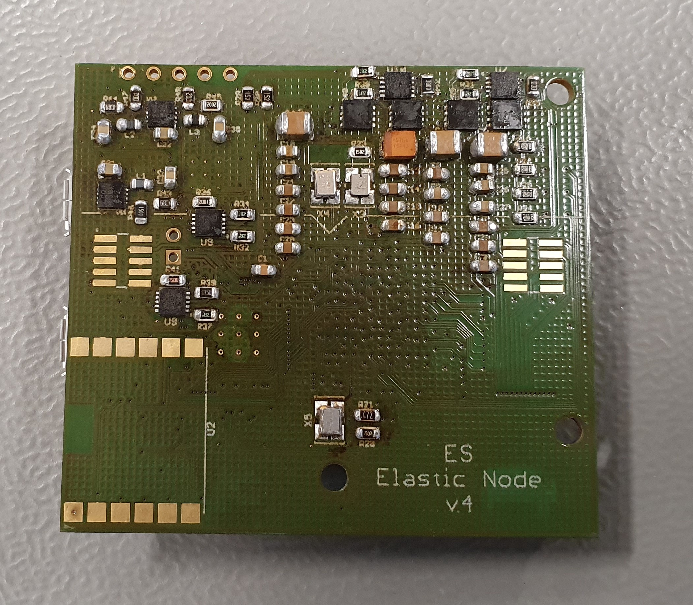
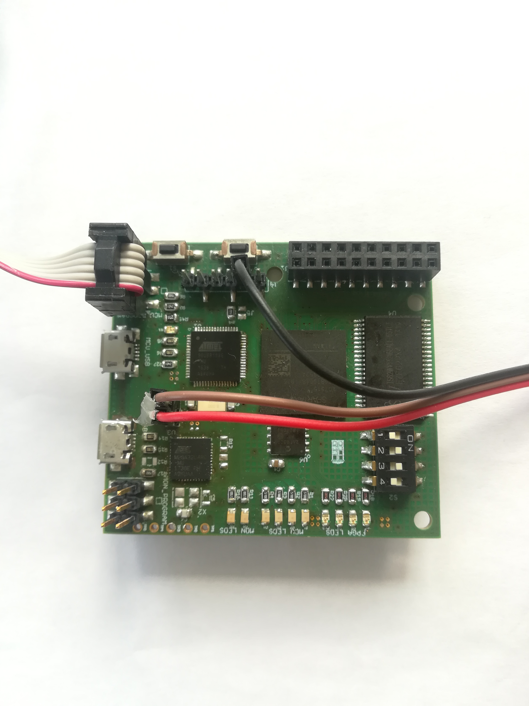
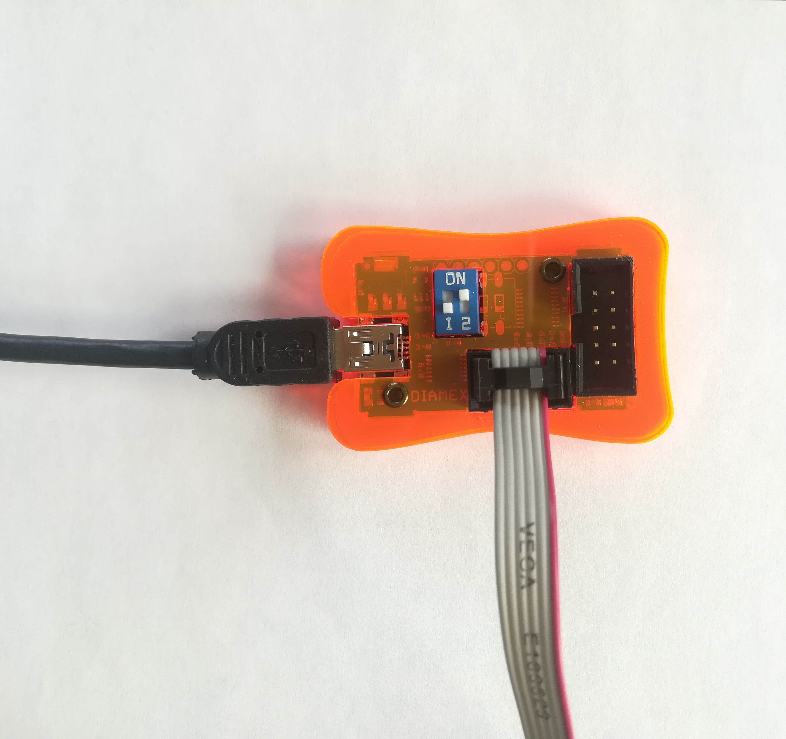
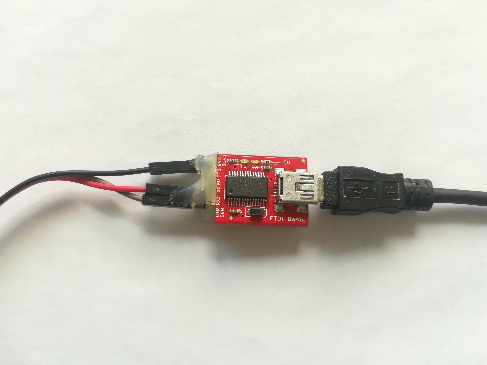
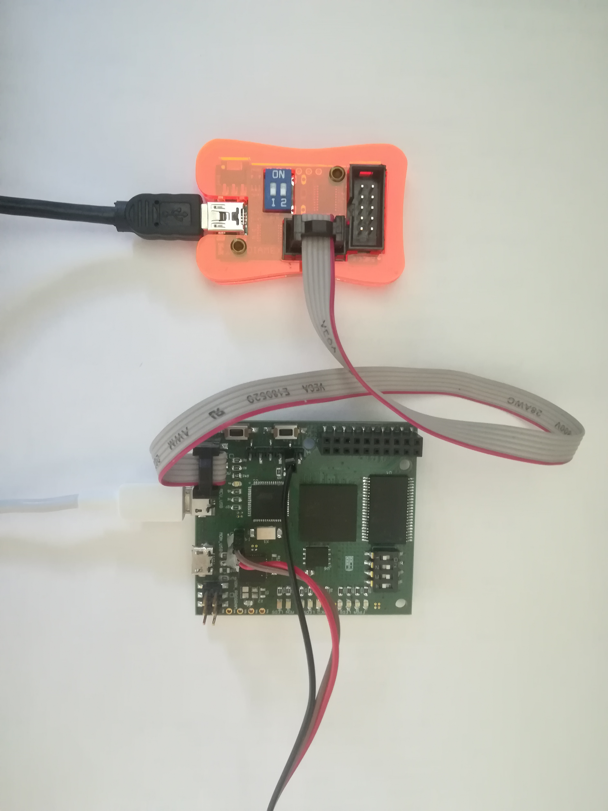
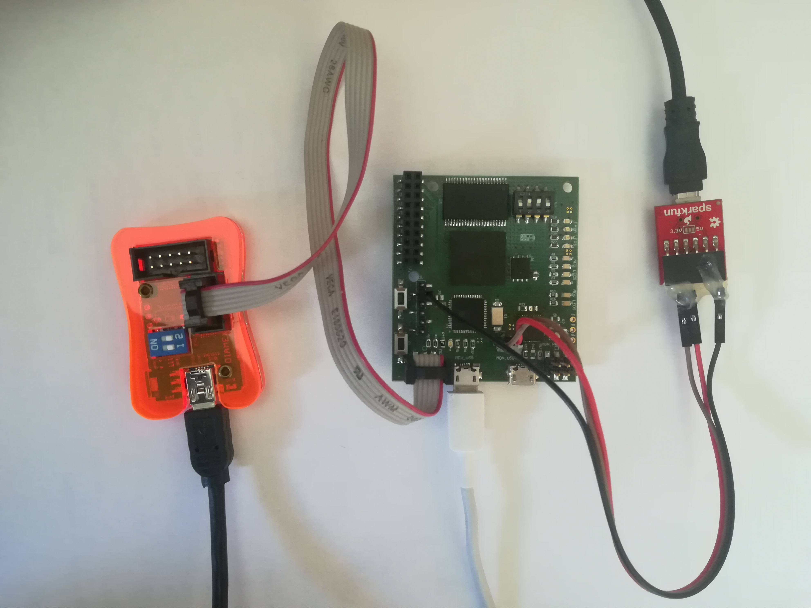

# Getting Started Guide

In the following we explain how to use the elastic node middleware code.
Therefore, we show how to connect the hardware and how to run a minimal example as well as the needed commands for building and uploading the target.

## Hardware

The following photos show the elastic node. 
The left yellow rectangle is the FPGA while the right yellow rectangle is the used MCU. 
The left red rectangle at the top shows the FPGA LEDs. 
The right red rectangle at the top shows the MCU LEDs. 
These LEDs should blink in the blink example. 
The right red rectangle shows the connection to the MCU.

The elastic node is connected to a programmer with 6 jumper wires female to female.
In the following pictures this is the grey cable. 
The connected elastic node and programmer are shown in the following image.
Please note which jumper wire connect to a pin at the elasticnode is connected to which pin at the programmer.

The programmer is connected with your computer with an USB-to-MiniUSB cable. 
The MiniUSB is connected to the programmer and the USB is connected to your computer.
The elasticnode itself is connected with your computer via an USB-to-MicroUSB cable.
The micro-USB cable is plugged in the elasticnode at the place which is circled red in the first image above.
This place is labeled with MCU_USB. 
The USB is plugged in your computer. 

For communication purposes you need a FTDI-adapter.
This adapter is connected with the elastic node with 3 jumper wires male to female.
The receive (RXI, brown cable) and transmit (TXD, red cable) pins of the FTDI-adapter are connected with the uart pins.
The ground (GND, black cable) pin of the FTDI-adapter is connected to the ground pin of the elastic node (see picture above).
The FTDI-adapter has again a connection to the computer like the programmer with a USB-to-MiniUSB cable. 
The MiniUSB is connected to the FTDI-adapter and the USB is connected to your computer.

The following photo shows the construction after connecting the whole hardware.

 
## How to use the Code

After cloning the [elasticnode middleware github repository](https://github.com/es-ude/ElasticNodeMiddleware) and installing [Bazel](https://www.bazel.build/), you can run a mini example. 
In the [main.c](../app/main.c) we show a minimal working example of how to use the elastic node middleware code. 
This implementation uses functions of the external Bitmanipulation library.
The functions just set or clear a bit in the transferred byte_ptr at the transferred offset. 

Missing!

## Build and Upload Command

For building the minimal example in the [main.c](../app/main.c) you have to run the following command: 

    $ bazel build //app:main --platforms=@AvrToolchain//platforms:ElasticNode_v4

Thereby is the second word the command (here: "build") and the third word is the path to the file (here: //app:main), we want to build. 
The leftover command are bazel flags for specializing the platform.  
    
The upload script is specialized in the [BUILD.bazel](../app/BUILD.bazel) in the app folder. 
For running the upload script you have to run: 

	$ bazel run //app:_mainUpload --platforms=@AvrToolchain//platforms:ElasticNode_v4

## Uploading the example Bitfile

For uploading our dummy bitfile you first have to build and run the ... like explained above.
Note the dummy.bit in the project folder elasticnodemiddleware.
For uploading go into the test folder of the project and run the following command:

    $ python test_dummy.py
    
This uploads the dummy bitfile in round about a minute. 
Make sure you use python version 3 instead of python version 2. 

## Tests

We write some test for checking the functionalities of our code. 
If you want to run a test of the code (here for example the xmem_Test), you have to run:

    $ bazel test test:xmem_Test

If you want to run all tests:

    $ bazel test test:all
    
If you want to run the integration test you have to use the build and uploads commands as written above.
For example for building the integration test for xmem:

    $ bazel build //test/integration:test_xmem --platforms=@AvrToolchain//platforms:ElasticNode_v4 

and for uploading this integration test

    $ bazel run //test/integration:_test_xmemUpload --platforms=@AvrToolchain//platforms:ElasticNode_v4

The structure of these commands is the same like explained above. 