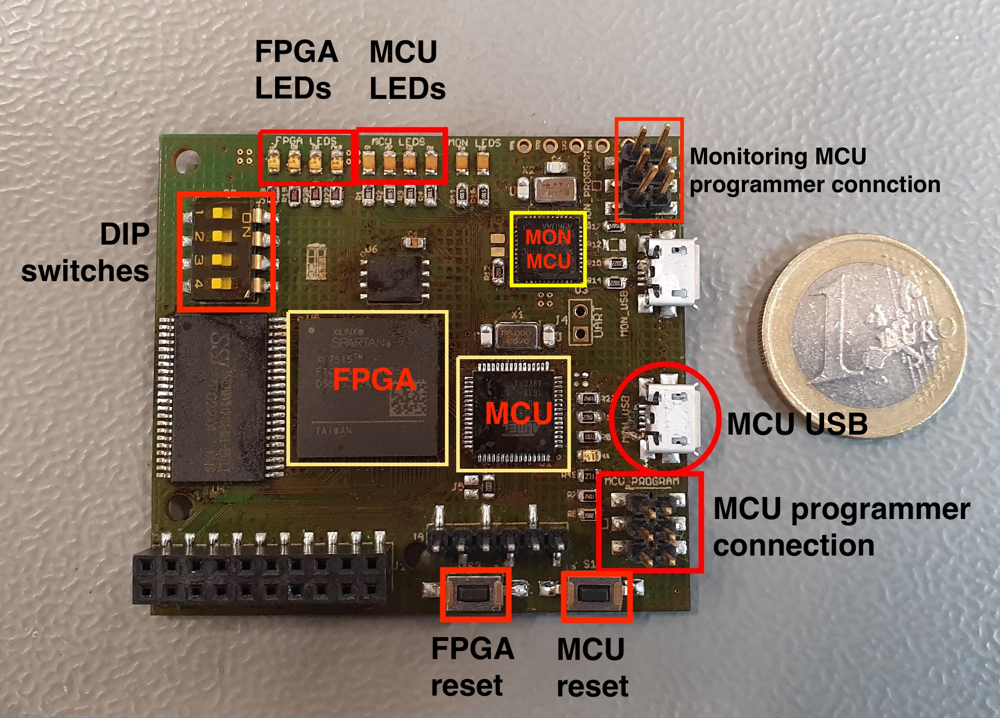

# Getting Started Guide

## Hardware

The following photos show the elastic node front and back. 

  
   

The elastic node is connected to a programmer with 6 jumper wires female to female.
In the following pictures this is the grey cable. 
The connected elastic node and programmer are shown in the following image.
Please note which jumper wire connect to a pin at the elastic node is connected to which pin at the programmer.
The programmer is connected with your computer with an USB-to-MiniUSB cable.

 
If you want to communicate via UART you need a FTDI-adapter.
We don't need this communication, it is only for testing purposes.
This adapter is connected with the elastic node with 3 jumper wires male to female.
The receive (RXI, brown cable) and transmit (TXD, red cable) pins of the FTDI-adapter are connected with the UART pins.
The ground (GND, black cable) pin of the FTDI-adapter is connected to the ground pin of the elastic node (see picture above).
The FTDI-adapter has again a connection to the computer like the programmer with a USB-to-MiniUSB cable. 

  

The elastic node itself is connected with your computer via an USB-to-MicroUSB cable. You see the MicroUSB labeled in the first image.
The following photo shows the setup after connecting the hardware.

  

### DIP Switches

The four switches on the Elastic Node are usually set as in the first picture (OFF,ON,ON,OFF). 
When you have trouble uploading something to the Elastic Node turn off the third switch while uploading.

## How to use the code

For using the elastic node middleware code with the elastic node, the two serial ports are needed. 
In the following they will be refer to as ports.
With Ubuntu and macOS you can run

    $ ls /dev

before and after you plug in the devices and the newly added device is the needed port.
The programmer should always be visible, but the elastic node itself only when in debug mode. 
For more information refer to the debug section in the [Writ Own Program Guide](WriteOwnProgramGuide.md#Debug).

In all guides the programmer will be "ttyACM0" and the elastic node itself "ttyACM1".

### Writing your own program

To use the elastic node middleware as a library, use the [Write Own Program Guide](WriteOwnProgramGuide.md).

### Clone repository

For modifying something in the middleware code itself, clone the code using the [Clone Guide](CloneGuide.md).
