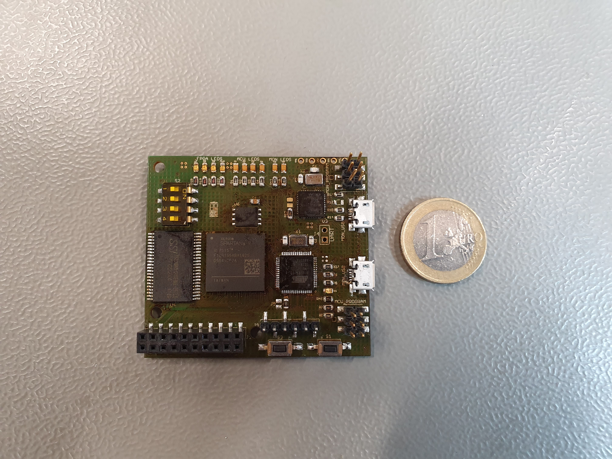

# Installation

## Hardware

To work with the elastic node middleware you need the right hardware. 
You need the elastic node as seen in the images below and a programmer.
If you want to use UART for other communication, you need a UART device additionally.
On top of this, you need a USB-to-MicroUSB (?) cable and ... (cable for programmer, GPIO cable?).

To use the Elastic Node Middleware Code, you have to connect your computer with the hardware.
You first put the USB port in your USB port at your computer and the MicroUSB port in the port at the elastic node.
In doing so you should use the MicroUSB port for the MCU and not for Monitoring (MON).
Then you connect the ... cable with the MCU program pins for the MCU, whereby on the other side you connect the programmer with it.
The following photo shows the construction.

--> missing 

## Bazel

For building and testing our code we use the tool [Bazel](https://www.bazel.build/).
For using the elastic node middleware code, you need to install bazel.
The installation is explained on the website [bazel installation](https://docs.bazel.build/versions/2.2.0/install.html).
As declared in the .bazelversion file, we use the bazel version 2.1.1.
Please install the right version.
If you use an IDE, you can check on the [bazel website for IDEs](https://docs.bazel.build/versions/2.2.0/ide.html) if your IDE can integrate bazel as a plugin.

## Github Repository

The elastic node middleware code is uploaded in a [github repository](https://github.com/es-ude/ElasticNodeMiddleware).
For using the code, you have to clone the repository. 