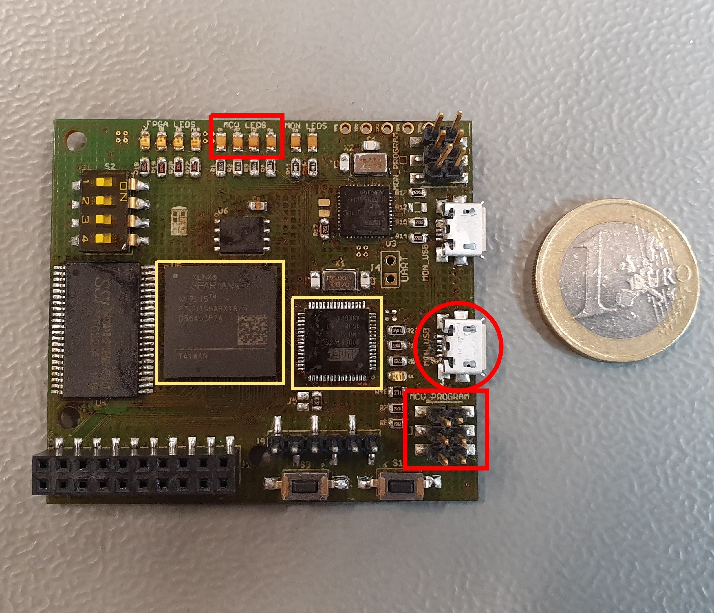

# Installation

## Hardware

To work with the elastic node middleware you need the right hardware. 
You need the elastic node which is shown in the images below and a programmer.
If you want to use UART for other communication, you need a UART device additionally.
On top of this, you need a USB-to-MicroUSB (?) cable and ... (cable for programmer, GPIO cable?).

The following photos show the elastic node. 
The left yellow rectangle is the FPGA while the right yellow rectangle is the used MCU. 

## Bazel

For building and testing our code we use the tool [Bazel](https://www.bazel.build/).
For using the elastic node middleware code, you need to install bazel.
The installation is explained on the website [bazel installation](https://docs.bazel.build/versions/2.2.0/install.html).
As declared in the .bazelversion file, we use the bazel version 2.1.1.
Please install the right version.
If you use an IDE, you can check on the [bazel website for IDEs](https://docs.bazel.build/versions/2.2.0/ide.html) if your IDE can integrate bazel as a plugin.

## Python

For uploading a bitfile to the FPGA we use python scripts. 
Therefore, you need to install [python](https://www.python.org/downloads/).
Please use the python version 3 instead of python version 2. 

## Github Repository

The elastic node middleware code is uploaded in a [github repository](https://github.com/es-ude/ElasticNodeMiddleware).
For using the code, you have to clone the repository. 

